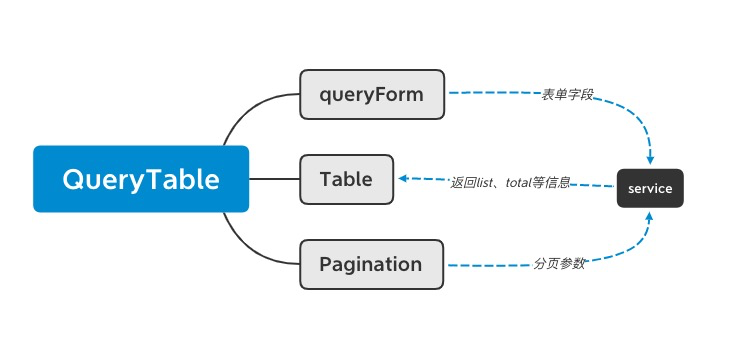

### 简介

y-for-table 是服务于vue生态中后台应用的解决方案，table查询式列表和表单是中后台领域的最常见场景：
  我们首先来讲一下查询式table的组成：
  - queryForm 用来设置查询条件的表单
  - table 用来展示列表数据的组件
  - Pagination 用来设置分页条件的组件

  那么三者之间的关系如下
  

queryForm、Pagination产生查询列表的接口的查询条件，接口执行到服务端获取用于Table组件消费的list数据， 同时Pagination 需要数据总条数 total用于处理分页页码展示；

不论三个组件使用哪套UI库，关系大概就是这样，所以y-for-table内置的YQueryTable组件就是为了简化 查询式Table展示的场景，当然也不仅限于Table，只要是list展示都可以处理。

